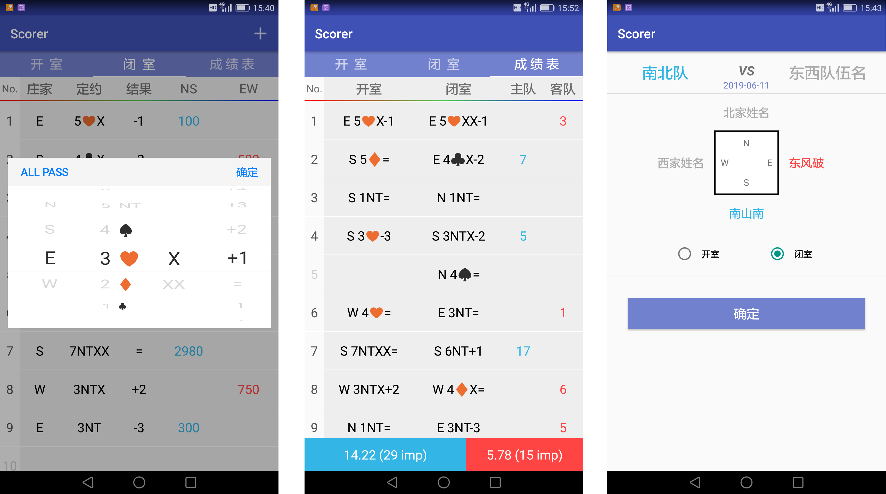
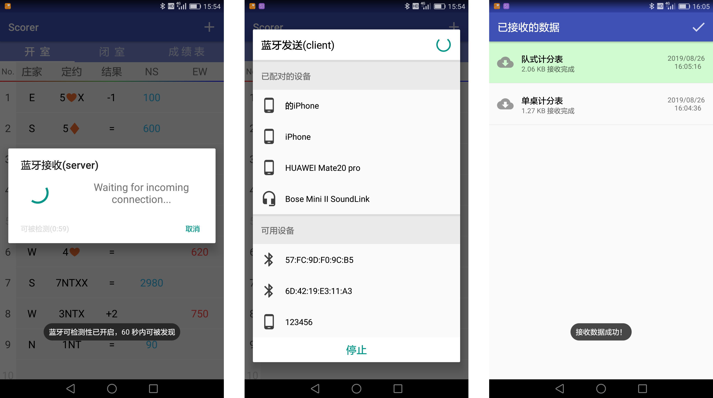
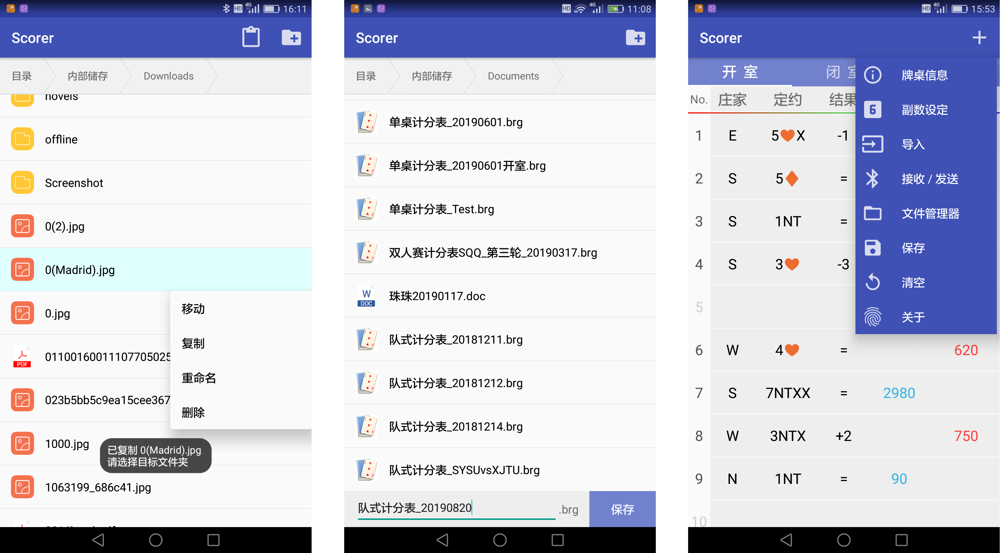

# Scorer
 a Scorer of Bridge for Android (Based on Bluetooth)

一款基于蓝牙通讯的Android桥牌计分录入器

#### 特色

- 根据被录入数据的概率分布特点，定制PickerView，在同类软件中，采用独有的滑动方式。

人性化设计，输入次数由5~6次下降至平均3次，错误率降低，并能快速纠错。实验对比，平均录入速度提高1倍。

- 蓝牙通讯降低了使用门槛，同类软件均需电脑、服务器配套使用。

#### 已实现的功能

1. 基本录入功能(单桌、队式计分表，包括日期、队名等基本信息)
2. 自动算分、结算，直接生成成绩表
3. 蓝牙通讯模块(接受/发送文件，配对、扫描设备)
4. 文件管理器功能
   - 打开、保存特定后缀的文件
   - 移动、复制、删除、新建、调用程序打开、重命名、浏览目录等基本功能

#### 软件截图

##### 基本功能

##### 蓝牙通信模块

##### 文件管理器及其他功能

